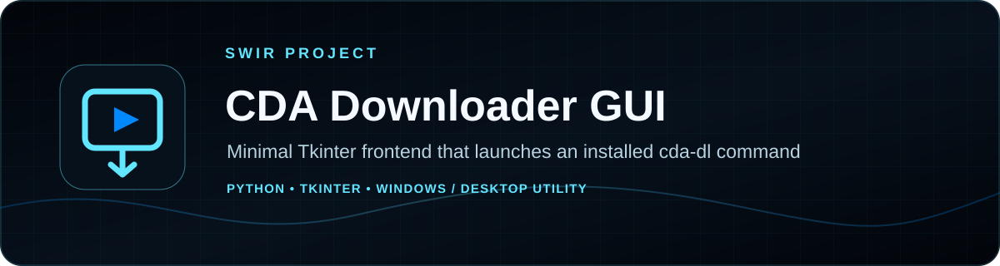
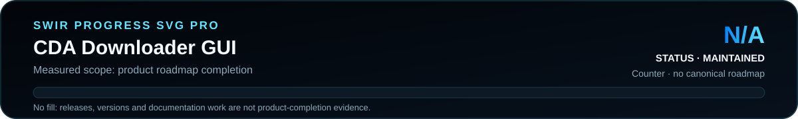

<!-- SWIR-README-STANDARD:v2 -->

<div align="center">



<br>


[](https://github.com/Swir)

[**Highlights**](#-highlights) · [**Quick Start**](#%EF%B8%8F-quick-start) · [**Progress**](#%EF%B8%8F-roadmap--progress) · [**Legal Use**](#%EF%B8%8F-legal-use--limitations)

</div>

## 📍 Project Status

| Item | Status |
|---|---|
| Current stage | Legacy desktop utility |
| Runtime | Python 3 + Tkinter + external `cda-dl` command |
| Repository build | Historical `cda.exe` is stored in the repository |
| Latest public GitHub release | **None published** |
| Product progress | **N/A** — no canonical measurable roadmap exists |

<p align="center">
  
</p>

Product progress is **N/A**. The presence of a binary or source file is not converted into an invented completion percentage.

## 🚀 Overview

**CDA Downloader GUI** is a small Tkinter wrapper around an externally installed `cda-dl` command. The user enters a CDA page URL, the GUI launches `cda-dl <url>` in a background Python thread, and the application reports success or an error through message boxes.

The project does not implement its own video extraction engine, account handling, DRM bypass or paid-access circumvention. It delegates download behavior to the locally installed `cda-dl` command.


## ✨ Highlights

| Feature | What it does |
|---|---|
| 🔗 URL input | Accepts a page URL from the desktop GUI |
| ▶️ One-click launch | Runs the external `cda-dl` command with the supplied URL |
| 🧵 Background execution | Starts the command from a worker thread so the click handler does not block the main flow |
| ✅ Basic feedback | Displays success and error dialogs |
| 🐍 Source included | The complete GUI wrapper is in `cda.py` |
| 🪟 Existing Windows binary | The repository also contains a historical `cda.exe` build |

## ⚙️ Quick Start

### From source

```bash
git clone https://github.com/Swir/cda-pl.git
cd cda-pl
python cda.py
```

Before launching the GUI, install `cda-dl` using its own trusted upstream instructions and verify that the command is available on `PATH`:

```bash
cda-dl --help
```

The GUI will not download anything by itself if that command is missing.

### Existing repository binary

The repository contains `cda.exe`, but there is currently **no GitHub Release and no release checksum published for it**. Prefer source execution when you need a transparent, auditable path.

## 📋 Requirements / Compatibility

- Python 3.x.
- Tkinter available in the Python installation.
- A working `cda-dl` executable on `PATH`.
- Desktop environment capable of showing Tkinter windows.

The source does not include dependency installation or `cda-dl` itself.

## 🎮 Usage / Workflow

1. Start `cda.py`.
2. Paste a supported CDA page URL into the input field.
3. Select **Pobierz Wideo**.
4. The wrapper launches `cda-dl` with that URL in a background thread.
5. Review the success/error dialog returned by the wrapper and the downloader's own output/files.

## 🧠 Technology / Architecture

| Layer | Technology / role |
|---|---|
| GUI | Python Tkinter |
| Execution | `subprocess.run(["cda-dl", url], check=True)` |
| Concurrency | Python `threading.Thread` |
| Download logic | External `cda-dl` command, not implemented in this repository |

## 🗺️ Roadmap / Progress

<p align="center">
  
</p>

**Product progress: N/A.** There is no authoritative product roadmap/checklist in this repository, so no completion percentage is fabricated.

## 📦 Releases

There are currently **no GitHub Releases** for this repository. The checked-in `cda.exe` is not presented here as a versioned, checksummed release artifact.

[**GitHub Releases →**](https://github.com/Swir/cda-pl/releases)

## ⚖️ Legal Use / Limitations

- Use this wrapper only for media you are authorized to download and store.
- Do not use it to bypass paid access, DRM or other technical restrictions.
- Respect the service's terms, copyright and applicable law.
- This repository does not audit or control the behavior of whatever `cda-dl` executable is installed on the user's system; obtain dependencies from a trusted source and review them separately.
- The wrapper performs minimal URL validation and does not provide download queue management, format selection or its own network stack.

## 🔎 Search Keywords

`cda downloader gui` • `cda-dl frontend` • `python tkinter downloader gui` • `cda desktop wrapper` • `python subprocess gui` • `tkinter background thread` • `windows video downloader wrapper` • `cda python utility` • `authorized media downloader` • `cda-dl tkinter`

<div align="center">

### `PASTE • LAUNCH • VERIFY`

⭐ **If this utility is useful as a reference, consider leaving a star.**

[**← SWIR profile**](https://github.com/Swir) · [**All projects →**](https://github.com/Swir?tab=repositories)

</div>
